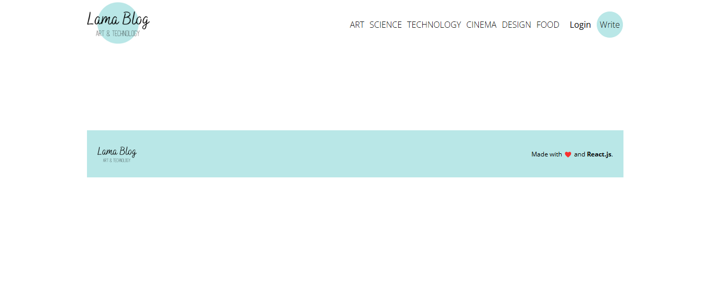
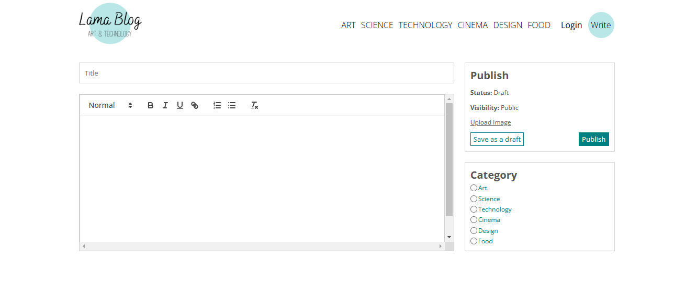

# Personal Blog Platform

This repository contains the source code and deployment instructions for a simple personal blog platform. The application is designed as part of an assessment for the Full Stack Intern position at CrowdWisdomTrading. It demonstrates skills in web development, cloud deployment, and system configuration.

## Table of Contents

- [Features](#features)
- [Technologies Used](#technologies-used)
- [Setup Instructions](#setup-instructions)
- [Deployment Process](#deployment-process)
- [Architecture Overview](#architecture-overview)
- [Live Demo](#live-demo)
- [Future Improvements](#future-improvements)

---

## Features

### Frontend
- **Homepage**: Displays a list of blog posts.
- **Post Creation Form**: Allows users to create new blog posts.
- **Responsive Design**: Works on both desktop and mobile devices.
- **Navigation Menu**: For easy navigation within the application.

### Backend
- **REST API Endpoints**:
  - `GET /api/posts`: Retrieves all blog posts.
  - `POST /api/posts`: Creates a new blog post.
  - `GET /api/posts/{id}`: Retrieves a single blog post by ID.
- **Data Storage**: Utilizes in-memory storage or a basic database for storing posts.
- **Authentication**: Basic authentication implemented for API access.

### Deployment
- Hosted on **Azure App Service**.
- Database integration via **Azure SQL Database** (if applicable).
- Basic monitoring set up for performance and error tracking.

---

## Technologies Used

### Frontend
- **HTML5**
- **CSS3**
- **JavaScript**
- **React.js** (preferred framework)

### Backend
- **Node.js** / **Express.js** (or another backend framework of your choice)
- **Basic Authentication** implementation
- **LLM Integrations** for enhanced functionality (if applicable)

### Deployment
- **Azure App Service**
- **Azure SQL Database** (if a database is used)

---

## Setup Instructions

1. **Clone the Repository**:
   ```bash
   git clone https://github.com/yourusername/personal-blog-platform.git
   cd personal-blog-platform

2. **Install Dependencies**:
- Navigate to the frontend and backend directories and run:
    ```bash 
    npm install

3. **Run Locally**:
- Start the backend:
    ```bash
     cd backend
     npm start

- **Start the frontend**:
   ```bash
    cd frontend
    npm start

- **Environment Variables**:

- Create a .env file in the backend directory and configure the following:

    ```bash
    PORT=5000
    DATABASE_URL=<Azure SQL Database URL or local database URL>


## Architecture Overview

### Frontend
- **React-based application** with a responsive design.
- Communicates with the backend through **RESTful APIs**.

### Backend
- **REST API** built using **Node.js/Express.js** (or another backend framework of your choice).
- Handles **authentication** and **CRUD operations** for blog posts.

### Database
- Optionally uses **Azure SQL Database** for persistent storage.

# My Blog

Here are some screenshots of my blog:

## Home Page


## Register Page


## Login Page


## Blog Post Page

